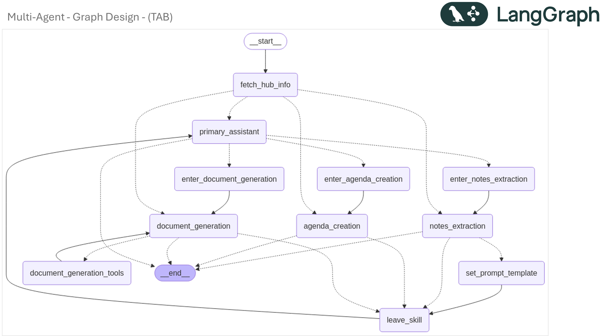

# Technical Architect Buddy (TAB) for Innovation Hub - M365 Agents SDK

## Overview
TAB is an AI-powered conversational agent built with the **Microsoft 365 Agents SDK** that helps Technical Architects at Microsoft Innovation Hub prepare for customer engagements. It provides an interactive chat experience through Microsoft Teams with two powerful approaches for creating Innovation Hub session agendas:

1. **Meeting Notes-Based Creation**: Automatically extracts key information from meeting notes, intelligently identifies agenda goals, and generates structured agendas tailored to specific customer requirements.

2. **Topic Selection-Based Creation**: Guides users through an interactive topic selection process to retrieve and customize pre-built golden document templates, enabling rapid agenda creation for standard engagement patterns.

Both workflows result in professional Microsoft Word documents ready for customer presentations, with automatic speaker assignments and proper time sequencing for Innovation Hub sessions.

## Features
- **Interactive Chat Interface**: Built as a Microsoft 365 conversational agent accessible through Teams and other channels
- **Dual Agenda Creation Modes**: 
  - **Meeting Notes-Based**: Extracts metadata and agenda goals from internal and external meeting notes via natural conversation
  - **Topic Selection-Based**: Creates agendas from pre-built golden document templates by selecting primary and secondary topic tags
- **Meeting Notes Analysis**: Extracts metadata and agenda goals from internal and external meeting notes via natural conversation
- **Golden Document Templates**: Library of pre-configured agenda templates organized by topics (e.g., Data & Analytics, AI, Agentic AI, Microsoft Fabric)
- **Dynamic Topic Selection**: Interactive topic tag selection with primary and secondary categorization for precise template matching
- **Agenda Creation**: Generates detailed agendas based on extracted information, customer requirements, or selected topics
- **Document Generation**: Creates formatted Microsoft Word (.docx) documents ready for customer presentations
- **Speaker Matching**: Automatically assigns appropriate speakers from the Innovation Hub team based on topics
- **State Management**: Maintains conversation context and user preferences across sessions
- **Multi-Hub Support**: Generic implementation supporting multiple Innovation Hub locations through configuration
- **LLM-Based City Resolution**: Intelligent hub location detection that understands indirect references (e.g., "garden city of India" → Bengaluru)

## Technology Stack
This implementation leverages the **Microsoft 365 Agents SDK** with the following architecture:
- **Microsoft 365 Agents SDK**: Core conversational AI framework
- **Azure OpenAI**: LLM integration with managed identity authentication
- **LangGraph**: Multi-agent workflow orchestration
- **Azure Blob Storage**: Document and state persistence
- **Azure Container Apps**: Cloud deployment platform
- **aiohttp**: Asynchronous web framework for hosting

## System Architecture
The application uses a conversational agent approach with multiple specialized components:
- **TABAgent**: Main conversational agent handling Microsoft Teams interactions
- **Primary Assistant**: Routes user requests to appropriate specialized agents based on intent
- **Notes Extractor Agent**: Extracts and validates metadata and goals from meeting notes (meeting notes-based workflow)
- **Golden Document Selection Agent**: Guides users through topic selection and template retrieval (topic selection-based workflow)
- **Agenda Creator Agent**: Generates structured agendas based on extracted information or selected templates
- **Document Generator Agent**: Creates and formats Word documents with the agenda using Azure OpenAI's Responses API
- **State Management**: Manages user state and conversation context using Microsoft 365 Agents SDK state management
- **Hub Master Info Provider**: Supplies hub-specific information including speaker mappings, locations, and capabilities
- **Agenda Mapping Manager**: Maintains the mapping between topic tags and golden document templates


## Solution Architecture


## Prerequisites
- Python 3.12+
- Azure OpenAI Service with GPT-4 deployment
- Azure Blob Storage account
- Azure Application Insights (optional, for logging)
- Azure Container Apps (for deployment)
- Microsoft App Registration for bot authentication
- Microsoft 365 Agents SDK (pre-release)

## Setup Instructions
1. **Clone the repository**
   ```bash
   git clone <repository-url>
   cd tab-agent-bot
   ```

2. **Install dependencies**
   ```bash
   pip install -r requirements.txt
   ```

3. **Configure environment variables**
   - Copy `.env.example` to `.env` and configure with your Azure service details
   - Required environment variables:
     - `TENANT_ID`: Azure AD tenant ID for guest tenant
     - `CLIENT_ID`: Azure App Registration client ID
     - `CLIENT_SECRET`: Azure App Registration client secret
     - `HOST_TENANT_ID`: Azure AD tenant ID for host tenant (for multi-tenant support)
     - `az_openai_endpoint`: Azure OpenAI endpoint URL
     - `az_deployment_name`: Azure OpenAI GPT-4 deployment name (e.g., "gpt-4o")
     - `az_openai_api_version`: Azure OpenAI API version (e.g., "2025-03-01-preview")
     - `az_blob_storage_account_name`: Azure Blob Storage account name
     - `az_blob_container_name`: Container for generated agenda documents
     - `az_blob_container_name_hubmaster`: Container for hub master information
     - `az_blob_container_name_state`: Container for conversation state
     - `az_blob_golden_docs_container_name`: Container for golden document templates
     - `az_storage_rg`: Azure resource group name for storage account
     - `az_subscription_id`: Azure subscription ID
     - `hub_cities`: Comma-separated list of supported hub cities (e.g., "Atlanta, Boston, Bengaluru, New York...")
     - `hub_assistant_file_ids`: JSON mapping of hub locations to Azure OpenAI file IDs for Responses API (e.g., `{"bengaluru": "assistant-XXXX"}`)
     - `file_ids`: Default file ID for Responses API (fallback when hub-specific not found)
     - `log_level`: Logging level (e.g., "DEBUG", "INFO")
     - `az_application_insights_key`: Application Insights connection string (optional)

4. **Run locally for development**
   ```bash
   python app.py
   ```

5. **Deploy to Azure Container Apps**
   - Build and push container image
   - Configure Azure Container Apps with environment variables
   - Set messaging endpoint in Azure Bot Service to: `https://<your-container-app-url>/api/messages`

## Workflow

TAB supports two distinct workflows for creating Innovation Hub session agendas:

### Workflow 1: Meeting Notes-Based Agenda Creation

1. **Start Conversation**: User initiates chat with TAB through Microsoft Teams
2. **Hub Location Detection**: User specifies their Innovation Hub location (supports direct names or indirect references like "garden city of India" for Bengaluru)
3. **Choose Creation Method**: User indicates they want to create an agenda from meeting notes
4. **Provide Meeting Notes**: User shares meeting notes (internal briefing notes or external customer notes) through natural conversation
5. **Notes Analysis**: The Notes Extractor Agent:
   - Extracts metadata sequentially (Customer Name, Engagement Type, Mode of Delivery, Depth of Conversation, Lead Architect, Date/Time, Target Audience)
   - Validates each field and confirms with user before proceeding
   - Identifies agenda goals from the meeting notes
   - Presents structured confirmation message with all extracted information
6. **Agenda Generation**: The Agenda Creator Agent:
   - Maps goals to specific agenda topics using business rules
   - Assigns speakers from the Innovation Hub team based on topic expertise
   - Generates time-sequenced agenda with proper session timings (10 AM start, lunch breaks, 5-6 PM end)
   - Follows engagement-specific templates (Business Envisioning, Solution Envisioning, ADS, Rapid Prototype, etc.)
7. **Document Creation**: The Document Generator Agent creates a formatted Word document
8. **Delivery**: The final document is saved to Azure Blob Storage and can be shared with the customer
9. **State Persistence**: Conversation state and user preferences are maintained across sessions

### Workflow 2: Topic Selection-Based Agenda Creation (Golden Documents)

1. **Start Conversation**: User initiates chat with TAB through Microsoft Teams
2. **Hub Location Detection**: User specifies their Innovation Hub location
3. **Choose Creation Method**: User indicates they want to create an agenda from golden document templates
4. **Greeting & Explanation**: The Golden Document Selection Agent explains the process
5. **Metadata Collection**: Agent collects required information:
   - Customer Name
   - Engagement Type (BUSINESS_ENVISIONING, SOLUTION_ENVISIONING, ADS, RAPID_PROTOTYPE, HACKATHON, CONSULT)
   - Date of Engagement (DD-MMM-YYYY format, must be future date)
   - Venue (Innovation Hub facility, Virtual Session, or Customer's office)
6. **Topic Selection**: 
   - **Primary Tags**: Agent dynamically presents available primary topic tags from the agenda mapping (e.g., "Data & Analytics", "AI", "Agentic AI", "Microsoft Fabric", "Purview")
   - User selects one or more primary topics by number or name
   - **Secondary Tags**: Agent presents relevant secondary tags associated with selected primary tags
   - User optionally selects secondary topics for more specific customization
7. **Document Identification**: Agent identifies the matching golden document template based on selected tags
8. **Confirmation**: Agent presents summary of all collected information and selected document for user confirmation
9. **Template Retrieval & Customization**: 
   - Retrieves the golden document from Azure Blob Storage (hub-specific location)
   - Customizes document with customer-specific information (customer name, date, venue, engagement type)
   - Replaces placeholders with actual values
10. **Document Presentation**: Agent presents customized agenda in Markdown table format
11. **Iterative Refinement**: User can request changes; agent applies free-form edits based on feedback
12. **Final Confirmation**: Once user approves, agent proceeds to document generation
13. **Document Creation**: The Document Generator Agent creates a formatted Word document
14. **Delivery**: The final document is saved to Azure Blob Storage and can be shared with the customer

### Key Differences Between Workflows

| Aspect | Meeting Notes-Based | Topic Selection-Based |
|--------|---------------------|----------------------|
| **Input** | Meeting notes (internal/external) | Interactive topic selection |
| **Metadata Source** | Extracted from notes | Collected via conversation |
| **Agenda Content** | Derived from meeting goals | Pre-configured template |
| **Customization** | Automatic based on goals | Tag-based template selection |
| **Best For** | Unique/custom engagements | Standard engagement patterns |
| **Speed** | Requires note analysis | Faster, guided selection |

## Multi Agent Design

Here is the graph for the multi agent App




Here are the details of the role of each Agent in the Multi agent system, and how the workflow progresses.


## Golden Document Templates

The application supports pre-configured agenda templates (golden documents) stored in Azure Blob Storage for rapid agenda creation.

### Template Organization

Golden documents are organized by:
- **Hub Location**: Templates are stored in hub-specific folders (e.g., `hub-bengaluru/documents/`)
- **Topic Tags**: Each template is associated with primary and secondary topic tags
- **Engagement Type**: Templates are designed for specific engagement types (Solution Envisioning, ADS, etc.)

### Topic Tag Structure

The agenda mapping system uses a two-level tag hierarchy:

**Primary Tags** (Main topic areas):
- Data & Analytics
- Data Agents
- Data Governance
- Microsoft Fabric
- Purview
- AI
- Agentic AI
- AI Foundry
- Multi Agent
- Pro code

**Secondary Tags** (Sub-topics or related areas):
- AI
- Agentic AI
- AI Foundry
- (and others based on context)

### Template Customization

When a golden document is retrieved, the following placeholders are automatically replaced:
- `$CustomerName` → Actual customer name
- `$Date` → Engagement date in DD-MMM-YYYY format
- `$Venue` → Engagement venue details
- `$EngagementType` → Type of engagement
- `$HubLocation` → Innovation Hub location
- Additional hub-specific placeholders based on template content

### Adding New Golden Documents

To add a new golden document template:

1. **Create the Template**: 
   - Create a markdown file with the agenda structure
   - Use placeholders (`$CustomerName`, `$Date`, etc.) for dynamic content
   - Include speaker names from the hub's speaker mapping table
   - Follow the standard agenda format with time slots, topics, and descriptions

2. **Upload to Azure Blob Storage**:
   - Upload to the appropriate hub folder: `hub-{location}/documents/`
   - Use descriptive filename (e.g., `Agenda - Solution Envisioning – DataAI.md`)

3. **Update Agenda Mapping**:
   - Edit `golden_docs/agenda_mapping.md`
   - Add a new row with Primary Tags, Secondary Tags, and DocumentURL
   - Ensure tag names are consistent with existing taxonomy

4. **Configure Hub-Specific File IDs** (for Responses API):
   - Update `hub_assistant_file_ids` in `.env` with hub-specific file IDs
   - Format: `{"hub-name": "assistant-FILE_ID"}`
   - These file IDs are used by the Responses API to access hub-specific documents and templates

### Agenda Mapping Configuration

The `golden_docs/agenda_mapping.md` file defines the relationship between topics and templates:

```markdown
| Primary Tags | Secondary Tags | DocumentURL |
|--------------|----------------|-------------|
| "Data & Analytics", "Data Agents" | "AI", "Agentic AI" | Agenda - Solution Envisioning – DataAI.md |
| "AI", "Agentic AI", "AI Foundry" | | Agenda-Solution Envisioning -AgenticAI.md |
```

The Golden Document Selection Agent dynamically reads this mapping to present available options to users.

## Configuration
Key configuration parameters are set in [`config.py`](config.py) and include:
- **Authentication**: Azure AD tenant, client ID, and client secret
- **Azure OpenAI**: Endpoints, deployment names, and API versions  
- **Storage**: Azure Blob Storage account and container details including:
  - `az_blob_golden_docs_container_name`: Container for golden document templates
  - `az_blob_container_name`: Container for generated agenda documents
  - `az_blob_container_name_hubmaster`: Container for hub-specific information
  - `az_blob_container_name_state`: Container for conversation state persistence
- **Logging**: Azure Application Insights configuration
- **Hub Settings**: 
  - `hub_cities`: Comma-separated list of supported Innovation Hub locations
  - `hub_assistant_file_ids`: JSON mapping of hub locations to Azure OpenAI file IDs for Responses API
  - `file_ids`: Default/fallback file ID for backward compatibility
- **Application**: Port settings and runtime configurations

## Key Files
- [`app.py`](app.py): Backwards-compatible wrapper that delegates to the new GA hosting stack
- [`agent_sdk.py`](agent_sdk.py): Primary agent application built on the GA Microsoft 365 Agents SDK with LLM-based hub location resolution
- [`start_server.py`](start_server.py): aiohttp hosting bootstrap used by `agent_sdk.py`
- [`config.py`](config.py): Configuration management with Azure service integration and hub-specific file ID mappings
- [`graph_build.py`](graph_build.py): LangGraph workflow orchestration for multi-agent interactions including:
  - Primary assistant routing logic
  - Notes Extractor Agent implementation
  - Golden Document Selection Agent implementation
  - Agenda Creator Agent implementation
  - Document Generator Agent implementation
- [`tools/agenda_selector.py`](tools/agenda_selector.py): Agenda generation logic and prompt templates for different engagement types (Business Envisioning, Solution Envisioning, ADS, Rapid Prototype)
- [`tools/doc_generator.py`](tools/doc_generator.py): Microsoft Word document creation utilities using Azure OpenAI Responses API
- [`tools/hub_master.py`](tools/hub_master.py): Hub-specific data and speaker management with expertise mappings
- [`tools/golden_doc_retriever.py`](tools/golden_doc_retriever.py): Golden document template retrieval and customization from Azure Blob Storage
- [`util/az_blob_storage.py`](util/az_blob_storage.py): Azure Blob Storage integration for conversation state and document storage
- [`util/az_blob_account_access.py`](util/az_blob_account_access.py): Blob account access management
- [`input_files/hub-bengaluru.md`](input_files/hub-bengaluru.md): Hub-specific speaker and topic mappings for Bengaluru Innovation Hub
- [`golden_docs/agenda_mapping.md`](golden_docs/agenda_mapping.md): Mapping table linking primary/secondary topic tags to golden document templates
- [`Dockerfile`](Dockerfile): Container configuration for Azure Container Apps deployment

## Microsoft 365 Agents SDK Architecture

This implementation now leverages the GA Microsoft 365 Agents SDK surface which provides:
- **AgentApplication** with decorator-based message handlers for authoring bot logic
- **CloudAdapter**: Handles communication between the bot and Microsoft channels
- **Authorization**: Centralized token validation driven by `MsalConnectionManager`
- **Hosting**: aiohttp-based hosting with JWT authorization middleware

### Key Components:

1. **AgentApplication Message Handler**
   - `agent_sdk.py` registers message handlers on the `AgentApplication`
   - Manages conversation flow, tenant authorization, and LangGraph integration
   - Persists conversation state through a dedicated `ConversationStateManager`

2. **State Management**
   - Internal turn state uses the SDK’s `MemoryStorage`
   - Long-lived conversation data is stored in Azure Blob Storage via the updated GA storage adapter
   - Conversation state automatically resets stale threads after prolonged inactivity

3. **Authentication & Authorization**
   - `MsalConnectionManager` and `Authorization` enforce Microsoft 365 token validation
   - Public network access to the storage account is verified (and re-enabled if required) per turn
   - Managed Identity authenticates outbound calls to Azure OpenAI and Azure Storage

4. **Multi-Agent Workflow (LangGraph)**
   - Orchestrates specialized agents for different tasks
   - Maintains workflow state across agent interactions
   - Enables complex document generation pipelines

## Deployment Architecture

The application is deployed on **Azure Container Apps** with:
- Container listening on `0.0.0.0:3978` for external connectivity
- Health check endpoint at `/health` for monitoring
- Message endpoint at `/api/messages` for bot communication
- Environment-based configuration for different deployment stages
- Managed identity integration for secure Azure service access

## Usage

### Getting Started

1. **Add the bot to Microsoft Teams** using the Azure Bot Service registration
2. **Start a conversation** with TAB in Teams
3. **Specify your hub location** when prompted
   - You can use exact city names (e.g., "Bengaluru", "New York", "London")
   - Or use indirect references (e.g., "garden city of India" for Bengaluru, "Big Apple" for New York)
   - The LLM-based resolver will intelligently match your input to the correct hub location
   - If no match is found, you'll be asked to select from the list of supported hubs

### Option 1: Meeting Notes-Based Agenda Creation

4. **Indicate you want to create an agenda from meeting notes**
5. **Provide meeting notes** by typing or pasting them in the chat (internal briefing notes or external customer notes)
6. **Follow the conversational flow** as TAB guides you through:
   - Sequential metadata extraction and confirmation (Customer Name, Engagement Type, etc.)
   - Agenda goal identification from notes
   - Speaker assignments based on topics
   - Document generation
7. **Review and approve** the generated agenda
8. **Receive the generated agenda document** via Azure Blob Storage link

### Option 2: Topic Selection-Based Agenda Creation

4. **Indicate you want to create an agenda from golden document templates**
5. **Provide required metadata** when prompted:
   - Customer Name
   - Engagement Type (select from predefined list)
   - Date of Engagement (must be a future date)
   - Venue (Innovation Hub, Virtual, or Customer's office)
6. **Select primary topics** from the dynamically presented list
   - Choose one or more topics that match your session needs
   - Topics include: Data & Analytics, AI, Agentic AI, Microsoft Fabric, etc.
7. **Optionally select secondary topics** for more specific customization
8. **Review the identified template** and confirm
9. **Review the customized agenda** presented in Markdown format
10. **Request changes** if needed (agent will apply free-form edits)
11. **Approve final agenda** to proceed to document generation
12. **Receive the generated agenda document** via Azure Blob Storage link

### Intelligent Hub Location Detection

TAB uses Azure OpenAI to intelligently resolve hub locations from user input:

**Examples of supported inputs:**
- ✅ "Bengaluru" → Matches Bengaluru
- ✅ "garden city of India" → Resolves to Bengaluru
- ✅ "Big Apple" → Resolves to New York
- ✅ "NYC" → Resolves to New York
- ✅ "Silicon Valley" → Matches Silicon Valley
- ✅ "tech capital of India" → Resolves to Bengaluru
- ❌ "Mars" → No match found, user prompted to select from valid list

The system first attempts simple keyword matching, then uses LLM for complex references, ensuring robust location identification while validating against the configured hub cities list.

## Development Notes

- Built with **Microsoft 365 Agents SDK** (pre-release version 0.0.0a3)
- Uses **LangGraph** for multi-agent workflow orchestration
- Implements **Azure managed identity** for secure service authentication
- Supports **containerized deployment** on Azure Container Apps
- Maintains **conversation state** across multiple interactions
- Includes **health monitoring** and logging capabilities

## Troubleshooting

### Common Issues:
1. **Connection errors**: Ensure the container is listening on `0.0.0.0:3978`, not `localhost:3978`
2. **Authentication failures**: Verify Azure AD app registration and managed identity configuration
3. **Blob storage access**: Check that public network access is enabled on the storage account
4. **OpenAI errors**: Confirm Azure OpenAI deployment name and endpoint configuration

### Health Check:
Visit `https://<your-container-app-url>/health` to verify the service is running and responsive.

## License
Copyright (c) Microsoft Corporation. All rights reserved.
Licensed under the MIT License.